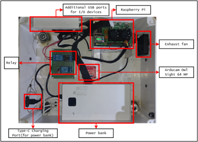

# 📱🔬 Cocolisap Detector (WIP)

**Cocolisap Detector** is a two-part system for detecting *Cocolisap* infestations in the field using **AI-powered instance segmentation (YOLOv5)**. It consists of:

1. **A mobile application** built with **React Native (Expo)** that captures and uploads images, processes them via a cloud backend, and provides a visual dashboard and geolocation tagging.
2. **A hardware prototype** inspired by a **digital microscope**, which runs the same detection software offline for use in remote areas without internet connectivity.

The system is developed in collaboration with the **Philippine Coconut Authority (PCA)**, who provided sample datasets for training and annotation.

> ⚠️ **Note:** Note: This repository contains only general and limited information about the project. All detailed specifications, source code(model training), datasets, and other proprietary materials are covered by a Non-Disclosure Agreement (NDA) with the Philippine Coconut Authority and cannot be publicly shared. The content here represents prototype versions and high-level overviews intended solely for public reference.
---

## 📚 Table of Contents

- [🧠 Project Overview](#-project-overview)
- [📱 Mobile Application](#-mobile-application)
- [🔧 Hardware Prototype](#-hardware-prototype)
- [🔍 Core Features](#-core-features)
- [🛠️ Tools & Technologies](#-tools--technologies)
- [🤝 Acknowledgment](#-acknowledgment)

---

## 🧠 Project Overview

The **Cocolisap Detector** project aims to support early detection of *Cocolisap* pests in coconut plantations. It provides tools for both field agents with internet access (via mobile app) and those operating in remote areas (via offline prototype).

- All detection is powered by a custom-trained **YOLOv5 instance segmentation** model.
- Training data was annotated from scratch using **[Roboflow](https://roboflow.com/)**.
- Development tools include **Google Colab**, **FastAPI**, and **VS Code**.

---

## 📱 Mobile Application

A feature-rich mobile app built using **React Native (Expo)** designed for field workers and researchers. It includes:

- Image capture using the device camera
- Upload to a **FastAPI** backend for AI-based segmentation
- Real-time **geolocation tagging**
- Access to a **data dashboard**, **detection history**, and **role-based access control**

> 🛜 **Note:** Requires internet connection for full functionality.

### 📷 Mobile Application UI Images
|  |  |
|:--:|:--:|
|  |  |

---

## 🔧 Hardware Prototype

A standalone hardware version of the app, designed to **mimic a microscope**. Built for field use where internet connectivity is unreliable or unavailable.

### Key Differences:
- **Offline** detection (no internet required)
- Same YOLOv5-based segmentation
- No dashboard, login, or history features
- Captures and processes images locally
- Ideal for quick detection in remote locations

### 📷 Prototype Images

|  |  |
|:--:|:--:|
| **Front View** | **Top View** |

|  |  |
|:--:|:--:|
| **Lateral View** | **Underside View** |

|  |
|:--:|
| **Lateral View** |

---

## 🔍 Core Features

- 🔐 **Role-Based Access** (Mobile Application)
  - **Employees**: Full access (`Login`, `Camera`, `Dashboard`, `Detection History`)
  - **Non-employees**: Limited access (`No login required`, basic dashboard view)

- 📷 **Image Capture**  
  Using the `Expo Camera` module

- 🌍 **Geolocation Tagging** (Mobile Application)
  Captures `City`, `Region`, `Country`, and GPS coordinates

- 🧠 **Cocolisap Detection**  
  Model served via `FastAPI` backend using `YOLOv5` (instance segmentation)

  <table>
    <tr>
      <td align="center"> <b>Captured Image</b></td>
      <td align="center"> <b>Result (Using Instance Segmentation)</b></td>
    </tr>
  </table>

- 📊 **Dashboard Analytics** (Mobile Application)
  Line and pie charts summarizing detections

- 🗃️ **Detection History** (Mobile Application)
  Scrollable table with timestamp, results, and fallback for no data for Mobile Application while Excel sheets for Prototype Hardware

---

## 🛠️ Tools & Technologies

- **React Native (Expo)**
- **YOLOv5** (Instance Segmentation)
- **FastAPI** and **MongoDB** (Python backend)
- **Roboflow** (Image Annotation)
- **Google Colab** (Model training)
- **Visual Studio Code** (Development)

---

## 🤝 Acknowledgment

This project is developed in partnership with the **Philippine Coconut Authority (PCA)**, Quezon City, Philippines, who provided annotated images and domain knowledge.

---
